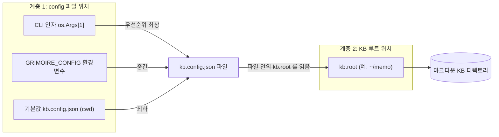
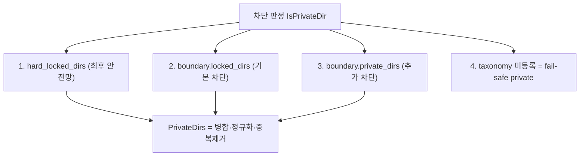

# Grimoire 설정 & 경로 스캐폴딩 가이드

로컬 마크다운 KB를 Grimoire에 연결할 때 **경로 지정 방식**과 **디렉토리 스캐폴딩 규칙**을 코드 근거와 함께 정리한다. 대상은 처음 셋업하거나, 다른 PC/KB로 이식하는 사용자다.

- **목적(Goal)**: `kb.config.json` 하나로 "내 마크다운 폴더"를 Grimoire에 연결하는 규칙을 명확히 한다.
- **배경(Context)**: Grimoire는 엔진(Go 바이너리)을 고정하고 환경 차이를 config로 외재화한다. 폴더 구조는 고정 규약이 아니라 config `taxonomy`로 선언한다.

---

## 1. 결론 요약 (3줄)

1. **KB 루트**는 환경변수가 아니라 `kb.config.json`의 `kb.root` 한 줄로 지정한다(예: `~/memo`).
2. **config 파일 위치**는 CLI 인자 또는 `GRIMOIRE_CONFIG` 환경변수로 지정한다(둘은 다른 계층이다).
3. **폴더 구조는 고정 규약이 없다.** `taxonomy.directories`로 선언하며, 미등록 디렉토리는 fail-safe로 private 처리된다.

---

## 2. 두 개의 경로 계층 (핵심 구분)

가장 흔한 혼동 지점이다. 경로는 **두 계층**으로 나뉜다.



| 계층 | 무엇을 가리키나 | 지정 방법 |
|---|---|---|
| **계층 1** | `kb.config.json` **파일 자체의 위치** | CLI 인자 > `GRIMOIRE_CONFIG` 환경변수 > 기본값 `kb.config.json`(cwd) |
| **계층 2** | 실제 **마크다운 노트 루트** | 계층 1이 가리킨 config 안의 `kb.root` 키 |

즉 **환경변수 `GRIMOIRE_CONFIG`는 "config 파일 경로"용이지 "노트 루트"용이 아니다.** 노트 루트는 언제나 config 안 `kb.root`다.

### 2.1 config 파일 경로 우선순위 (계층 1)

`cmd/grimoire/main.go` 의 `main` 기준:

1. 기본값 `"kb.config.json"` (현재 작업 디렉토리 기준)
2. `GRIMOIRE_CONFIG` 환경변수가 있으면 그 값으로 덮어씀
3. CLI 첫 번째 인자 `os.Args[1]`가 있으면 최종 덮어씀 → **인자가 최우선**

같은 규칙이 `cmd/grimoire-context/main.go`에도 적용된다. `cmd/reindex`는 CLI 인자만 받는다.

### 2.2 KB 루트 지정 (계층 2)

```jsonc
// kb.config.json
{
  "kb": {
    "name": "my-kb",
    "root": "~/memo",          // 이 한 줄이 노트 루트다
    "indexPath": ".grimoire/index",
    "exclude": ["**/assets/**", ".obsidian/**", ".git/**", "**/*.png"]
  }
}
```

- 구조체: `internal/config/config.go` 의 `Config.KB` (`KB.Root`)
- `~` / `~/` → 홈 디렉토리로 확장 (`config.go` 의 `expandTilde`). 절대경로도 가능.
- 루트는 **존재 검증만** 하고 자동 생성하지 않는다 → 루트 디렉토리 자체는 **미리 만들어 둬야 한다** (`config.go` 의 `Load`).

---

## 3. 디렉토리 스캐폴딩 규칙

### 3.1 고정 폴더 규약은 없다

`personal/`, `projects/`, `daily/` 같은 **하드코딩된 필수 폴더는 코드에 존재하지 않는다.** 디렉토리 구조는 전적으로 `taxonomy.directories`로 선언한다 (`config.go` 의 `Taxonomy`).

**강제 요건은 단 하나**: `taxonomy.directories`가 비어 있으면 로딩이 실패한다 (`internal/config/config.go`, `"taxonomy.directories 설정이 없습니다"`).

### 3.2 taxonomy 항목 스키마

각 디렉토리 항목은 `DirMeta`(`internal/config/config.go`)를 따른다:

| 필드 | 의미 |
|---|---|
| `type` | 노트 유형 (analysis/design/guide/runbook/… enum) |
| `domain` | 도메인 태그 (backend/ops/project 등 자유값) |
| `naming` | 파일명 규칙 (`naming_patterns` 키 참조) |
| `tone` | 문체 힌트 (report/guide/1st-person 등) |
| `ai_access` | 기본 접근 정책 (shared/private) |
| `nested` | 하위 디렉토리 중첩 허용 여부 (선택) |
| `redact` | 저장 시 민감어 스캔 대상 여부 (선택) |

이 카탈로그는 두 방향으로 쓰인다:
- **인덱싱 fallback**: 경로 → 메타 추론 (frontmatter 없을 때)
- **`write_note` 역매핑**: `type`/`domain` → 저장할 디렉토리 결정

```jsonc
"taxonomy": {
  "directories": {
    "docs":       { "type": "analysis", "domain": "general", "naming": "date-compact", "tone": "report",     "ai_access": "shared" },
    "guides":     { "type": "guide",    "domain": "ops",     "naming": "kebab",        "tone": "guide",      "ai_access": "shared" },
    "runbooks":   { "type": "runbook",  "domain": "ops",     "naming": "kebab",        "tone": "guide",      "ai_access": "shared" },
    "projects":   { "type": "design",   "domain": "project", "naming": "kebab",        "tone": "design",     "ai_access": "shared", "nested": true },
    "personal/diary": { "type": "reflection", "domain": "self", "naming": "mixed",     "tone": "1st-person", "ai_access": "private" }
  },
  "naming_patterns": {
    "kebab":        "<topic>-<detail>.md",
    "date-compact": "<YYYYMMDD>-<title>.md",
    "date-done":    "<YYYY-MM-DD>-<title>-done.md",
    "mixed":        "kebab 또는 <YYYY-MM-DD>-<title>.md"
  }
}
```

### 3.3 미등록 디렉토리 = fail-safe private

`taxonomy.directories`에 매칭되지 않는 디렉토리의 노트는 `frontmatter.Parse`가 `ai_access`를 **`private`로 채운다** → 인덱싱·검색에서 자동 제외된다 (`internal/frontmatter/frontmatter.go`).

노출하려면 **노트 frontmatter에 `ai_access: shared`를 명시(opt-in)** 해야 한다. "실수로 새 폴더를 만들어도 기본은 비공개"라는 안전 기본값이다.

---

## 4. 접근 경계 (Boundary): 3중 차단

차단 디렉토리(pull=검색/인덱싱/자동주입/컴파일 차단, push=write·명시 단건 read 허용)는 세 겹으로 보호된다.



1. **`boundary.hard_locked_dirs`**: 최후 안전망. `locked_dirs`가 비거나 오타로 빠져도 새지 않는다.
   ```jsonc
   "hard_locked_dirs": ["private/journal", "private/career"]
   ```
   - **키를 생략하면** `boundary.DefaultHardLockedDirs`(작성자 KB 기준 경로)가 적용된다. 다른 KB에는 대개 없는 경로라 무해하지만, 자신의 사적 폴더는 보호되지 않으므로 **직접 명시하는 편이 안전하다.**
   - **빈 배열(`[]`)** 은 "하드가드를 쓰지 않겠다"는 명시적 선택으로 해석한다.
2. **`boundary.locked_dirs`**: config 기본 차단 목록.
3. **`boundary.private_dirs`**: config 추가 차단 목록.
4. **taxonomy 미등록 디렉토리**: 위 §3.3의 fail-safe private.

병합 로직은 `PrivateDirs`, 경로 판정은 `IsPrivateDir`, frontmatter 값 판정은 `IsPrivateAccess`가 담당한다(`internal/boundary/boundary.go`).

> **이식**: 하드가드는 config로 지정하므로 다른 KB로 옮길 때 소스를 고칠 필요가 없다. 설정은 서버 시작 시 1회만 로드되어 세션 도중 무력화할 수 없다는 성질은 그대로다.
>
> ⚠️ **`private_frontmatter.deny_value`를 비우지 말 것.** 이 값이 비면 `IsPrivateAccess`가 항상 false가 되어 `ai_access: private` 선언과 미등록 디렉토리 fail-safe가 **모두 무시된다.** 남는 보호는 경로 기반 차단뿐이다. `grimoire-doctor`가 이 상태를 error로 잡는다.

---

## 5. Frontmatter 규칙

config `frontmatter` 블록으로 정의한다 (`config.go` 의 `Frontmatter`).

```jsonc
"frontmatter": {
  "core": ["title", "date", "type", "tags", "status", "ai_access"],
  "custom": "allow",
  "defaults": { "ai_access": "shared", "status": "active" },
  "enums": {
    "type":      ["analysis", "design", "guide", "runbook", "reflection", "blog", "reference", "log", "ops", "study", "talk", "note", "career"],
    "status":    ["draft", "active", "done", "archived"],
    "ai_access": ["shared", "private"]
  }
}
```

**추론(fallback) 우선순위** (`frontmatter.Parse`):
- `title` = frontmatter → 첫 H1 → 파일명
- `type`/`domain`/`ai_access` = frontmatter → 디렉토리 메타 → `defaults`
- `date` = **파일명에서만** 추출. frontmatter/파일명에 날짜가 없으면 **임의 생성하지 않는다**.

`write_note`가 생성하는 frontmatter는 `title/date/type/tags/status/ai_access` 순으로 고정 출력되며 atomic write(temp→rename)로 저장된다.

---

## 6. 초기 셋업 절차

### 6.1 이미 KB가 있는 경우 (권장)

`grimoire-init`이 디렉토리 구조와 노트 frontmatter를 근거로 taxonomy를 추론해 config 초안을 만든다.

```bash
make setup KB=~/notes   # 스캔 → kb.config.json 초안 + 검토 대상 표시
make index              # 인덱싱
make register           # Claude Code 등록
```

추론 규칙은 다음과 같다.

- **그룹 단위**: top-level 디렉토리를 한 줄로 등록한다. 단 직속 `.md`가 없고 하위 폴더가 여러 개인 컨테이너(예: `personal/`)는 성격이 섞이므로 한 단계 내려 분해한다(`personal/study`, `personal/work-logs` …).
- **type**: 노트가 실제로 쓰는 frontmatter `type`의 우세값이 1순위, 없으면 디렉토리 이름 휴리스틱.
- **naming**: 파일명이 날짜로 시작하는 비율이 절반을 넘으면 `date-compact`, 아니면 `kebab`.
- **ai_access**: 이름에 사적 키워드(career/diary/journal/private 등)가 있으면 `private`로 제안하고 `locked_dirs`에도 넣는다.

> ⚠️ **공개/비공개 판정은 이름 기반 추정이다.** 출력의 `공개 여부 확인 필요` 목록은 반드시 눈으로 확인해야 한다. 사적 폴더가 `shared`로 잡혔다면 그대로 두는 순간 검색·자동주입 대상이 된다.

저장 후 `make doctor`로 커버리지(전체 문서 중 실제 검색 가능한 비율)와 설정 정합성을 확인한다.

### 6.2 직접 작성하는 경우

```bash
# 1) 템플릿 복사
cp kb.config.example.json kb.config.json

# 2) kb.config.json 편집
#    - kb.root         → 본인 KB 경로 (예: ~/notes)
#    - taxonomy.*      → 본인 폴더 구조 (빠뜨린 폴더는 검색에서 조용히 빠진다)
#    - boundary.*      → 본인 비공개 디렉토리 (hard_locked_dirs 포함)

# 3) KB 루트 디렉토리는 미리 존재해야 한다 (config.Load 는 검증만 함)
mkdir -p ~/notes

# 4) 빌드 & 등록
make build && make register
```

- **디렉토리는 write 시 lazy 생성된다**: 존재하지 않는 taxonomy 디렉토리는 첫 `write_note` 때 `os.MkdirAll`로 자동 생성된다(`internal/writer/writer.go`). 인덱스 디렉토리(`indexPath`)도 마찬가지.
- 따라서 **폴더 트리를 미리 다 만들 필요는 없다.** 단, KB **루트**만은 `config.Load`가 존재를 검증하므로 미리 있어야 한다.

---

## 7. 운영 체크리스트

- [ ] `kb.config.json`은 개인 경로를 담으므로 **gitignore** 되어 있는가? (저장소엔 `kb.config.example.json`만 커밋)
- [ ] `kb.root` 디렉토리가 실제로 존재하는가? (없으면 서버 시작 실패)
- [ ] `taxonomy.directories`가 최소 1개 이상 선언돼 있는가? (비면 로딩 실패)
- [ ] 비공개로 다뤄야 할 폴더가 `boundary.locked_dirs` **또는** taxonomy `ai_access: private`에 포함됐는가?
- [ ] `boundary.hard_locked_dirs`가 본인 KB의 사적 폴더로 지정됐는가? (생략 시 작성자 기본값이 적용되어 본인 폴더는 보호되지 않는다)
- [ ] `grimoire-doctor`가 error 없이 통과하는가? (`make doctor`, 종료코드 0)
- [ ] 커버리지의 `제외(미분류·사고)`가 0인가? (0이 아니면 그 폴더는 검색에서 빠져 있다)

## 8. 보안 체크리스트

- 민감 폴더는 **config 한 곳에만** 의존하지 말고 `hard_locked_dirs`에도 등재해 편집 실수에 대비한다(이중화).
- `private_frontmatter.deny_value`를 비우면 사적 보호 대부분이 꺼진다(경로 차단만 남는다). `doctor`가 error로 잡는다.
- 경계 설정은 **시작 시 1회만 로드**되어 세션 중 무력화가 불가능하다(런타임 보호). 변경하려면 서버를 재시작한다.
- `redact.patterns`에 사내 식별자(코드네임/클러스터명/내부 도메인)를 넣으면, `redact:true` 디렉토리(예: `blog`) 저장 시 매칭되면 저장을 거부한다.
- 미등록 디렉토리 fail-safe private 덕분에 "실수로 만든 새 폴더가 인덱스에 노출"되는 사고를 구조적으로 막는다.

---

## 9. 참고 코드 위치

라인 번호는 쉽게 어긋나므로 파일과 심볼로 적는다.

| 관심사 | 위치 |
|---|---|
| config 구조체 / `KB.Root` / tilde 확장 / 루트 검증 | `internal/config/config.go` (`Config`, `expandTilde`, `Load`) |
| config 파일 경로 우선순위 | `cmd/grimoire/main.go` (`main`) |
| 하드가드 기본값 / 유효값 결정 | `internal/boundary/boundary.go` (`DefaultHardLockedDirs`, `HardLockedDirs`) |
| 차단 디렉토리 병합/판정 | `internal/boundary/boundary.go` (`PrivateDirs`, `IsPrivateDir`, `IsPrivateAccess`) |
| frontmatter 파싱/fallback / 미분류 표시 | `internal/frontmatter/frontmatter.go` (`Parse`, `Note.Unclassified`) |
| 미분류 스캔 / 인덱싱 회계 | `internal/index/indexer.go` (`ScanUnclassified`, `Stats`) |
| taxonomy 자동 추론 | `internal/initcfg/initcfg.go` (`Scan`, `propose`) |
| 설정·커버리지 진단 | `internal/doctor/doctor.go` (`Run`) |
| 학습노트 스캐폴딩 | `internal/study/study.go` (`Scaffold`) |
| write 시 디렉토리 lazy 생성 | `internal/writer/writer.go` (`Write`) |

> 설계 배경과 전체 스키마는 [design.md](./design.md) 참고.
