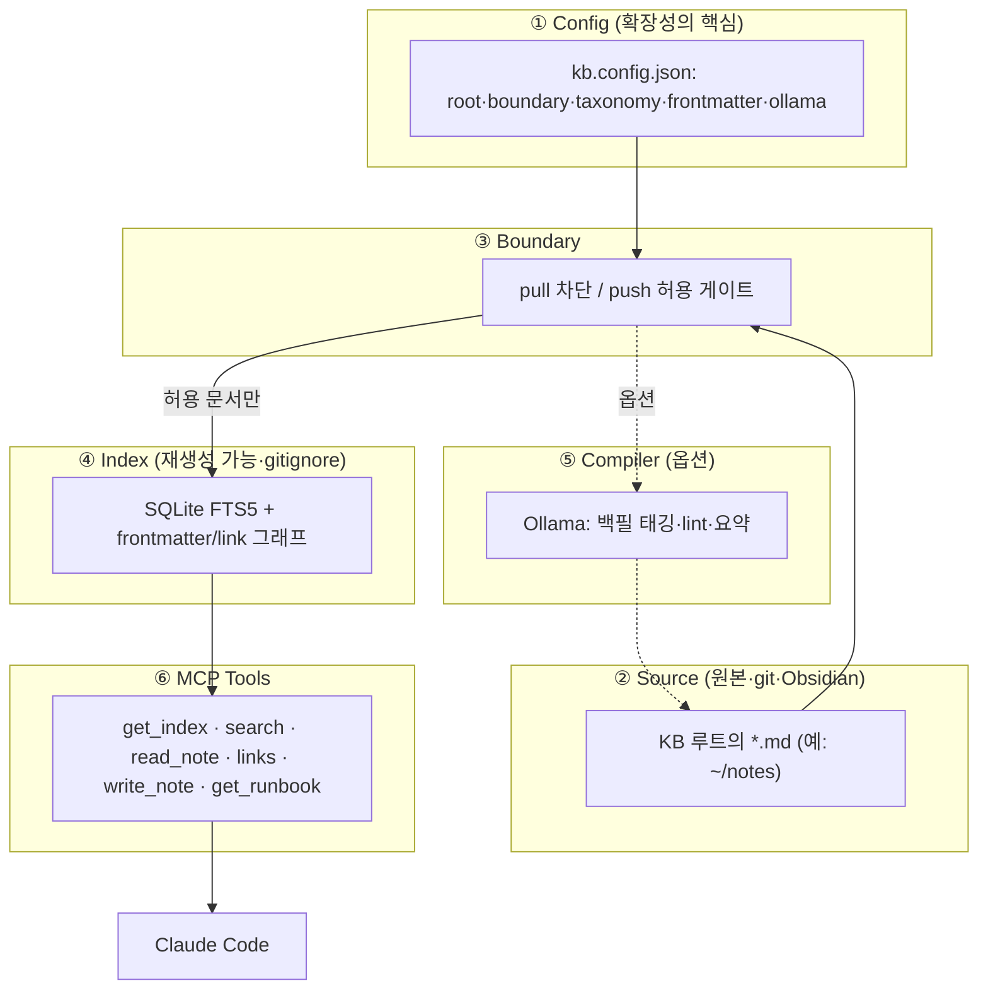
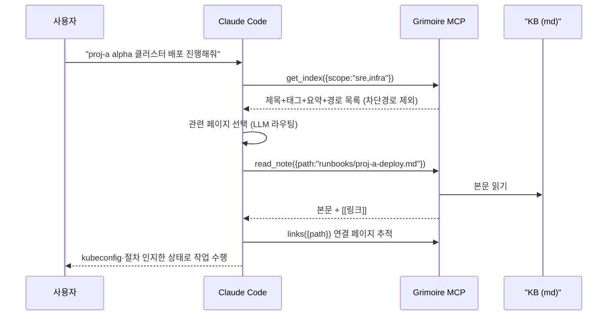
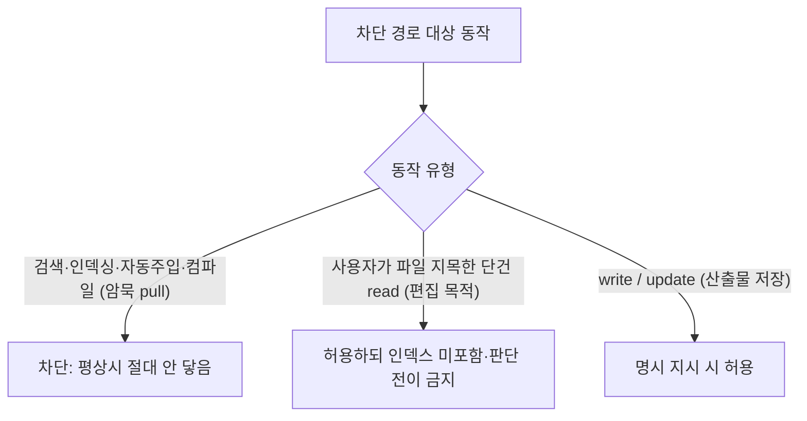
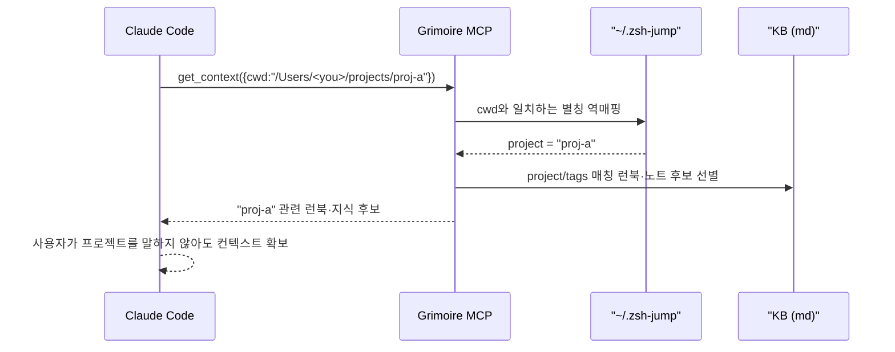
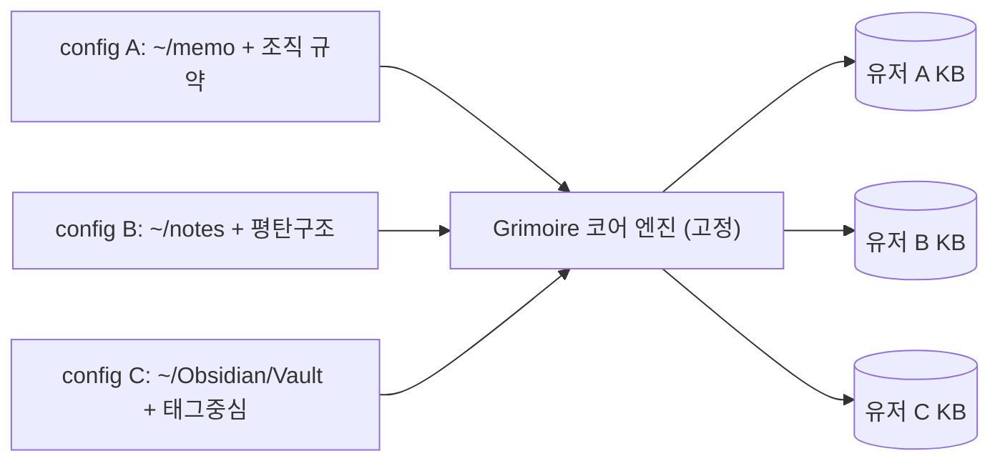
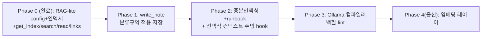

# Grimoire 설계서

> 개인 지식베이스(Personal Knowledge Base) MCP 서버.
> Andrej Karpathy의 LLM Wiki 방식을 차용해, 마크다운 KB를 single source of truth로 둔 채
> Claude Code가 반복 설명 없이 맥락을 끌어다 쓰고(RAG-lite), 분류 규약에 맞춰 산출물을 써넣게 한다.
> 임베딩을 쓰지 않으며, config 주도로 환경이 다른 다른 사용자도 확장 가능하게 설계한다.

- 상태: 설계 확정 (Phase 0 구현 대기)
- 작성일: 2026-05-29
- 구현 경로: `~/tools/grimoire`
- 스택: Go + stdio (단일 바이너리). 처음 Bun + TypeScript로 시작했다가 메모리·배포 이유로 전환 (8장 참고).

---

## 0) 목적 (Goal)

`~/memo`(마크다운 KB)를 single source of truth로 유지한 채, Claude Code가 다음 두 가지를 자동으로 하게 만든다.

1. 반복 설명 제거: "proj-a alpha/beta 클러스터는 어떤 kubeconfig로 들어가고 배포는 어떻게 한다" 같은 맥락을 매번 입력하지 않아도 KB에서 끌어다 쓴다.
2. 산출물 정착: "이 분석을 문서화해줘" 명령 시 분류 규약(디렉토리/파일명/톤)에 맞춰 알맞은 위치에 마크다운을 써넣는다.

핵심 제약:

- 별도 저장소(벡터DB 등)에 지식을 복제하지 않는다. 원본은 항상 마크다운 파일이다.
- 임베딩을 쓰지 않는다 (Karpathy 방식 + 인프라 부담 회피).
- 특정 경로(career/analysis/docs-career)는 AI가 능동적으로 끌어다 판단 근거로 삼지 않는다.
- 처음엔 유저 A(작성자) 개인화용이지만, 코어 엔진은 환경이 다른 사용자도 config 교체만으로 쓸 수 있어야 한다. 본 문서에 등장하는 `~/memo` 디렉토리 규약·파일명·마크다운 규칙은 **유저 A의 한 예시일 뿐 강제 규칙이 아니다.** 다른 사용자는 `kb.config.example.json`을 복사해 자신의 KB 구조(루트 경로/디렉토리/차단 정책)를 직접 정의한다.

---

## 1) 결론 요약 (TL;DR)

- 6 레이어 구조: Config → Source(md) → Boundary(pull 차단/push 허용) → Index(SQLite FTS5) → Compiler(옵션 Ollama) → MCP Tools.
- 검색 주체는 Claude다. MCP는 목차/본문/링크를 제공하고, 어떤 페이지를 읽을지는 Claude가 판단한다 (Karpathy 핵심: "검색을 임베딩에 위임하지 말고 LLM에 위임하라").
- 확장성은 "엔진 고정 + config 외재화"로 달성한다. "유저 A = 개인 KB + 조직 디렉토리 규약"을 전부 `kb.config.json`으로 빼낸다.
- 1차 릴리스(Phase 0) = `get_index` + `search` + `read_note` + `links` (RAG-lite). 쓰기/런북/Ollama는 후속 단계.

---

## 2) 배경 (Context)

### 2.1 왜 기존 솔루션이 안 맞았나

| 기준 | 벡터DB RAG (안 씀) | 내장 위키(git-ignored) | Grimoire (신규) |
|---|---|---|---|
| 저장 원본 | 벡터DB | 도구 내부 (git-ignored) | KB md (git/Obsidian) |
| 검색 | 벡터 임베딩 | 키워드+태그 | 키워드+태그+`[[링크]]` 탐색 |
| 모바일/Obsidian 노출 | 불가 | 불가 | 가능 |
| 인프라 | 벡터DB+임베딩 상시 | 없음 | 없음 (Ollama는 옵션) |
| Karpathy 부합 | 낮음 | 높음 | 높음 + 사용자 자산 통합 |
| 미스매치 원인 | 인프라 부담/이중화 | 저장위치 단절 | (해소 대상) |

벡터DB 기반 RAG는 지식을 벡터DB에 복제해 원본 마크다운과 단절되고 임베딩 인프라 부담이 크다. 도구 내장 위키는 Karpathy 모델을 잘 구현하지만 저장 위치가 도구 내부(git-ignored)라 모바일/Obsidian/git 동기화에서 단절된다. Grimoire는 이 단절을 없애고 사용자의 마크다운 KB 자체를 원본으로 둔다.

### 2.2 Karpathy LLM Wiki 방식의 본질

- RAG 우회: 쿼리마다 청크를 재검색/재합성하지 않고, 지식을 한 번 "컴파일"해 위키에 누적한다.
- 순수 마크다운: 벡터 임베딩 없음. LLM이 읽고 사람도 읽는 형식. Obsidian graph view 호환.
- LLM이 위키를 소유: 페이지 생성/갱신, 크로스레퍼런스 유지, 모순 표시, synthesis 갱신.
- 컴파일 비유: Raw Sources + LLM 컴파일 → 사전합성/상호연결된 Wiki.

참고: VentureBeat "bypasses RAG with an evolving markdown library maintained by AI", MindStudio "95% less token use than RAG".

### 2.3 KB 현황 실측 (유저 A 예시, 2026-05-29)

| 항목 | 결과 | 시사점 |
|---|---|---|
| frontmatter 보유 | 101개 중 1개 | 표준을 새로 도입. 기존 패턴 따를 게 없음 |
| 그 1개의 스키마 | `title, date, tags[], status, cluster, namespace` | 표준 출발점으로 채택 |
| `[[wikilink]]` | 3개 파일 | 링크 그래프 거의 없음 → 점진 구축 |
| 인라인 `#tag` | 2개 파일 | 태그도 거의 없음 |
| 파일명 | 주제기반 kebab + 날짜기반 | CLAUDE.md 규약과 일치 |
| Obsidian | `obsidian-git`만 | 순수 git 동기화 모델 |

가장 중요한 발견: frontmatter가 사실상 없다. "frontmatter 필수"로 설계하면 기존 100개 파일이 인덱스에서 전부 누락된다. 따라서 frontmatter는 "있으면 활용, 없으면 경로/제목/본문에서 추론(fallback)", 그리고 점진적으로 백필한다.

---

## 3) 설계/구조 (Design)



레이어별 책임:

| 레이어 | 책임 | 비고 |
|---|---|---|
| ① Config | 환경 차이 흡수 (경로/규약/정책) | 이게 확장성 |
| ② Source | 마크다운 원본 = SoT | 절대 복제하지 않음 |
| ③ Boundary | pull 차단(career/analysis/docs-career) / push 허용 | 코드 하드 가드 |
| ④ Index | FTS5 + 링크그래프 캐시 | gitignore, 언제든 재생성 |
| ⑤ Compiler | Ollama 백필/lint (없어도 동작) | 옵션 플러그인 |
| ⑥ Tools | MCP 인터페이스 | Claude가 라우팅 |

---

## 4) 동작 흐름 (Flow)

### 4.1 검색·주입 (RAG-lite)



컨텍스트 엔지니어링 메커니즘 (반복 설명 제거):

- 반복 절차는 `type: runbook` 페이지로 1회 작성한다 (예: `runbooks/proj-a-deploy.md`에 alpha/beta kubeconfig 경로, 배포 명령, 주의사항).
- 작업 시작 시 Claude가 `get_index`로 KB 지도를 받고, 해당 런북을 `read_note` 한 뒤 그 맥락으로 작업한다. 사용자가 매번 설명할 필요가 없다.

### 4.2 AI 접근 경계: pull 차단 / push 허용



| 동작 | 차단 경로에서 | 근거 |
|---|---|---|
| search / get_index / 자동탐색 / Ollama 컴파일러 | 차단 | AI가 학습/판단에 쓰는 경로. 지식 베이스에서 제외 |
| 자동 컨텍스트 주입 | 차단 | 평상시 맥락에 섞이면 안 됨 |
| 사용자가 특정 파일 지목한 단건 읽기 | 허용 | "기존 회고에 이어 써줘" 같은 편집 선행 읽기. 인덱스 미적재, 전이 금지 |
| write_note / update_note (산출물 저장) | 허용 | 분석 결과 문서화 = 핵심 워크플로우 |

결과적으로 차단 경로(`personal/career`, `personal/analysis`, `docs/career`)는 "지식 베이스가 아니라 산출물 보관함"으로 취급한다. AI가 평소 끌어다 쓰지는 않지만, 명령받으면 거기에 써넣는다.

### 4.3 작업 경로 인지 컨텍스트 라우팅 (cwd → project)

사용자는 자주 쓰는 작업 경로를 `jump`/`jumpadd` 커스텀 명령으로 등록한다. 저장 구조는 `~/.zsh-jump/<별칭>` 파일에 절대 경로 한 줄이 들어가는 플랫 레지스트리다 (예: `~/.zsh-jump/proj-a` → `/Users/<you>/projects/proj-a`).

이 레지스트리는 사용자의 작업 경로 토폴로지이자 프로젝트 식별자 사전이다. Grimoire는 이를 컨텍스트 신호원으로 활용한다.



설계 원칙:

- jump 레지스트리의 별칭 집합(`proj-a-*`, `proj-b-*`, `svc-x`, `svc-y` 등)을 frontmatter `project` 값과 런북 키의 사전 정의 어휘로 정렬한다. KB 태그 체계를 실제 작업 토폴로지와 일치시킨다.
- cwd가 jump 경로(또는 그 하위)와 일치하면 그 별칭을 project 컨텍스트로 추론해 검색/주입 범위를 좁힌다.
- 확장성: jump는 유저 A 개인 환경이다. 다른 유저는 zoxide/autojump를 쓰거나 아무것도 안 쓸 수 있다. 따라서 이 기능은 config의 `context_signals`로 추상화하고, jump_registry는 그 한 구현일 뿐이다. 신호원이 없으면 라우팅은 명시적 scope 인자에만 의존한다.

---

## 5) 표준 frontmatter 스키마

사용자의 기존 1개 파일 스키마를 수용하고 정책/타입 필드를 추가한다. 코어는 고정, 도메인 필드는 자유 확장.

```yaml
---
# === 코어 (엔진이 해석) ===
title: "서비스 alpha 랜딩 지연 점검"
date: 2026-05-28
type: analysis        # analysis|guide|runbook|reflection|blog|reference|log
tags: [infra-network, web, alpha]
status: done          # draft|active|done|archived
ai_access: shared     # shared(기본) | private(pull 차단)
# === 도메인 확장 (자유, 유저마다 다름) ===
cluster: cluster-a
namespace: web
---
```

- `ai_access: private` = 차단 디렉토리 밖에서도 개별 파일을 pull에서 제외하는 오버라이드.
- frontmatter 없는 기존 파일: 엔진이 경로(`infra-network/` → `type:analysis`, `tags:[infra-network]`), 제목, 본문에서 추론해 인덱싱한다. 동작에 지장 없음.
- 백필: Phase 3에서 Ollama가 추론값을 frontmatter로 제안하고, 사용자/Claude 검수 후 기록한다. 점진적이며 자동 덮어쓰기 금지.

---

## 6) 확장성 설계: 엔진 고정 + config 외재화

"유저 A 개인화"를 전부 설정으로 빼낸다. 다른 유저는 코어 코드 변경 없이 config만 교체한다.

```jsonc
// kb.config.json  (유저 A 예시)
{
  "root": "~/memo",
  "indexPath": ".kb-index/",          // gitignore
  "boundary": {
    "private_dirs": ["personal/career", "personal/analysis", "docs/career"],
    "private_frontmatter": { "key": "ai_access", "deny_value": "private" },
    "write_allowed_in_private": true   // push 허용 (산출물 보관함)
  },
  "taxonomy": {                        // CLAUDE.md 분류 결정트리를 config화
    "rules": [
      { "if": { "type": "runbook" }, "dir": "runbooks" },
      { "if": { "type": "analysis", "domain": "backend" }, "dir": "backend" },
      { "if": { "public": true }, "dir": "personal-blog", "redact": true }
    ]
  },
  "frontmatter": { "core": ["title","date","type","tags","status","ai_access"], "custom": "allow" },
  "ollama": { "enabled": false, "host": "http://localhost:11434", "model": "qwen2.5" },
  "context_signals": {                 // cwd → project 역매핑 (4.3)
    "jump_registry": "~/.zsh-jump",    // 별칭 파일 = 절대경로 플랫 저장소
    "cwd_project_mapping": true        // 다른 유저는 false 또는 zoxide 등 지정
  }
}
```



확장 포인트 7가지:

1. KB 루트/인덱스 경로
2. 차단 정책 (디렉토리 + frontmatter 키)
3. 분류 규약 (taxonomy rules) - 하드코딩 결정트리를 외재화
4. frontmatter 코어 + 커스텀
5. Ollama on/off
6. frontmatter 없는 기존 KB도 fallback으로 즉시 동작
7. 컨텍스트 신호원 (context_signals: jump/zoxide 등 cwd → project 매핑, 없으면 비활성)

이 7개가 "환경이 다른 다른 유저"를 흡수한다.

---

## 7) MCP 툴 세트 (단계별)

| 툴 | 기능 | 차단경로 정책 | Phase |
|---|---|---|---|
| `get_index({scope?})` | 목차(제목·태그·요약·경로) | 제외 | 0 |
| `search({query,tags?,dir?})` | FTS5 키워드+태그 | 제외 | 0 |
| `read_note({path})` | 본문 읽기 | 명시 단건만 허용 | 0 |
| `links({path})` | `[[링크]]` 그래프 추적 | 제외 | 0 |
| `write_note({title,content,type,...})` | 분류규약 적용 저장 | 쓰기 허용 | 1 |
| `get_runbook({name})` | 작업 런북 반환 | 제외 | 2 |
| `reindex()` / `lint()` | 인덱스 재생성 / 건강검진 | 제외 | 3(Ollama) |

---

## 8) 구현 스택

| 구성 | 선택 | 비고 |
|---|---|---|
| 런타임/언어 | **Go** | 단일 바이너리, cgo 불필요 |
| 배포 | **stdio per-session** | Claude Code가 프로세스 관리, 데몬 불필요 |
| MCP | 공식 `modelcontextprotocol/go-sdk` v1.6.1 | 제네릭 `AddTool`, struct→schema 자동 |
| 인덱스 | `modernc.org/sqlite` FTS5 (`.grimoire/`, gitignore) | 순수 Go(cgo 없이 FTS5) |
| frontmatter 파싱 | `gopkg.in/yaml.v3` + 직접 `---` 분리 | gray-matter 동등 |
| glob | `bmatcuk/doublestar/v4` | `**` 매칭 |
| 임베딩 | 없음 | |
| Ollama | 옵션 (`/api/generate`, 백필 전용) | Phase 3 |

### 8.1 Bun → Go 전환 근거와 메모리 진단

처음엔 Bun + TypeScript로 정하고 Phase 0 인덱서를 구현·검증했다. 이후 한 MCP 도구 제작자의 조언("Node류는 세션당 메모리 누적, idle 60MB")을 반영해 Go + stdio로 전환했다.

실측 결과(서버 시작 시 100개 인덱싱 포함 idle RSS):

| 구성 | idle RSS | 비고 |
|---|---|---|
| Go + modernc(순수 Go) | 28.2 MB | 채택 |
| Go + cgo(mattn) | 26.5 MB | 1.7MB 차 → cgo 무가치 |
| Bun (빈 서버) | 24.9 MB | 동급 |
| Node 동급 | 40~60 MB | |

진단: 메모리 주범은 sqlite 드라이버가 아니라(modernc vs cgo 1.7MB 차) Go 런타임 베이스 + 시작 시 전체 인덱싱이다. 따라서 modernc 유지(순수 Go 단일 바이너리)가 옳고, 추가 절감의 진짜 레버는 "시작 시 인덱싱 → 증분 캐시"(Phase 2)다. Go 28MB는 Node의 절반이라 조언 목표는 달성했고, cgo 없는 단일 바이너리라 stdio 배포가 가장 깔끔하다.

---

## 9) 예외/에러 처리

- KB 루트 경로가 없거나 읽기 불가: 기동 시 검증 후 명확한 에러로 종료.
- frontmatter 파싱 실패: 해당 파일은 fallback 추론으로 인덱싱하고, 파싱 실패를 로그로 남긴다 (인덱싱 자체는 계속).
- 차단 경로 접근 시도(검색/인덱싱/컴파일): 코드 하드 가드에서 무조건 거부. config로도 해제 불가.
- write_note 대상 디렉토리 결정 실패(taxonomy 미매칭): 저장하지 않고 사용자에게 분류를 되묻는다.
- 인덱스 손상: `reindex()`로 전체 재생성 (인덱스는 파생 자산이므로 안전).

---

## 10) 운영 고려사항 (Operations)

- 인덱스는 재생성 가능 자산이다. 현재는 서버 시작 시 전체 인덱싱(Phase 2에서 fsnotify watch 또는 mtime 증분으로 대체 예정). `reindex` CLI로 수동 재생성 가능. git 충돌과 무관(gitignore).
- Obsidian이 같은 파일을 동시 편집할 수 있다. MCP write는 atomic write(temp → rename)로 처리하고, 충돌 시 사용자 편집을 우선한다.
- 백필은 항상 "제안 → 검수 → 기록" 순서. frontmatter 자동 덮어쓰기 금지.
- 첫 인덱싱 시 frontmatter 없는 100개 파일의 fallback 추론 결과를 로그로 남겨 점검한다.

---

## 11) 보안 체크리스트 (Security)

- pull 차단(career/analysis/docs-career)은 코드 하드 가드로 최후 방어선을 둔다. config는 "추가 차단"만 가능하고 "기본 차단 해제"는 불가하게 한다.
- 인덱스/캐시/로그에 차단 경로의 제목, 요약, 경로조차 기록하지 않는다.
- 2번째 레이어 필수: `~/memo/CLAUDE.md`에 "career/analysis/docs-career는 능동 pull 금지, 명시 지시 시만 read/write" soft policy를 명문화한다. hard `deny`는 Edit 워크플로우(선행 Read 요구)를 깨므로 지양한다.
- Ollama 컴파일러는 차단 파일을 읽지 않는다.
- frontmatter에 토큰/비밀번호/인증서를 평문으로 적지 않는다(`<REDACTED>`).

위협 모델 주의: 이 경계는 "외부 침입자"가 아니라 "본인 세션 속 AI의 자동 행동 통제"가 목적이다. 따라서 검색/자동주입 차단(평상시 격리)이 핵심 보호이고, 명시적 단건 read 직후 세션 컨텍스트에 일시 잔존하는 것은 완전 격리 불가능함을 인지한다. 세션을 넘기면 자연 분리된다.

---

## 12) 대안 및 트레이드오프

| 결정 | 선택 | 대안 | 기준 |
|---|---|---|---|
| 인덱스 | SQLite FTS5 | 인메모리 스캔 | 수백~수천 규모면 FTS5가 안정적, 재시작 빠름 |
| 주입 방식 | 명시 호출(get_index → read) | 세션시작 hook 자동주입 | 자동주입은 토큰낭비/차단경로 위험 → 명시 우선, Phase 2에서 선택적 hook |
| KB 개수 | 단일 root | 멀티 root | 1차 단일, config 배열화로 확장 가능 |
| 임베딩 | 없음 | Ollama 임베딩 레이어 | 수만 문서 + 탐색질문 잦아지면 Phase 4 옵션 |
| 런타임 | Go | Bun / Node | Node는 세션당 메모리 큼. Go는 단일 바이너리 + Node 절반 메모리 |
| 배포 | stdio per-session | HTTP 단일 데몬 | stdio는 데몬 관리 불필요. 메모리 누적이 문제되면 데몬 전환 가능 |
| SQLite 드라이버 | modernc(순수 Go) | mattn(cgo) | 메모리 1.7MB 차뿐이라 cgo 빌드 복잡성 불채택 |

---

## 13) 로드맵



- Phase 0 (완료, Go): config 로더 + 인덱서(FTS5, fallback 추론) + `get_index`/`search`/`read_note`/`links` + stdio MCP 서버. Bun과 동일 결과 검증, 단일 바이너리 14MB.
- Phase 1: `write_note` (taxonomy 규약 적용 저장, atomic write).
- Phase 2: 증분 인덱싱(mtime/fsnotify, 시작 메모리·시간 절감) + `get_runbook` + `get_context`(cwd → project 라우팅, jump 레지스트리 연동) + 선택적 세션시작 컨텍스트 주입 hook.
- Phase 3: Ollama 컴파일러 (frontmatter 백필 제안, lint).
- Phase 4(옵션): 문서가 수만 규모로 커지고 탐색형 질문이 잦아질 때 임베딩 레이어 추가.

---

## 14) 확정된 핵심 결정사항

1. 원본은 마크다운 (개인 KB 루트). 벡터DB 등 별도 저장소에 복제하지 않는다.
2. 임베딩 미사용. 검색 라우팅 주체는 Claude.
3. AI 접근 경계 = pull 차단 / push 허용. 차단 목록은 `personal/career`, `personal/analysis`, `docs/career` 3개로 확정.
4. 확장성 = 엔진 고정 + config 외재화 (`kb.config.json`).
5. frontmatter는 있으면 활용, 없으면 fallback 추론, 점진 백필.
6. 스택은 Go + stdio per-session, 공식 `go-sdk` + `modernc` sqlite(순수 Go). Bun+TS에서 전환(메모리·단일 바이너리). 메모리 주범은 드라이버가 아니라 시작 시 인덱싱 → Phase 2 증분 캐시가 절감 레버.
7. 작업 경로 인지 라우팅: `~/.zsh-jump` 레지스트리로 cwd → project를 역매핑해 컨텍스트를 자동으로 좁힌다. config의 `context_signals`로 외재화하며 다른 유저는 비활성 가능.
